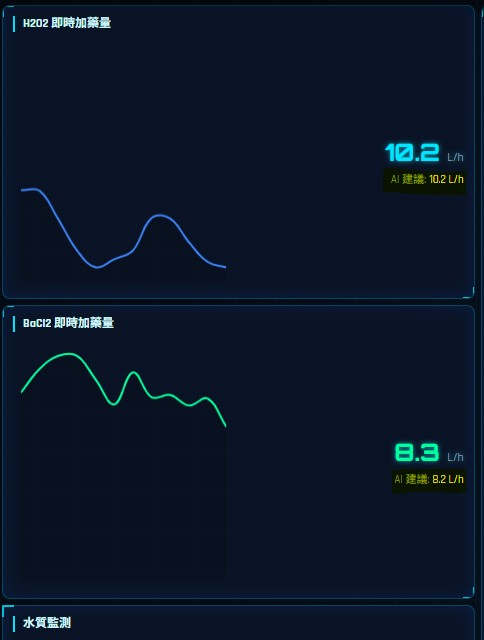

# 問題文檔

##   一、 流量表單 狀態對應欄位 {#water-quality-ph}

- **H2O2 即時加藥量**
  - `amount_H2O2_P_209AB`
- **BaCl_2 即時加藥量**
  - `amount_BaCl2_P_210AB`
- **水質監測**
  - **進水硼濃度**
    - `concentration_B`
  - **出水硼濃度**
    - 待確認
  - **進水量**
    - `flow_FIT201`
  - **出水量**
    - `flow_waste`

### 2. COP硼廢水處理流程 狀態對應欄位

- **Raw Water 運作**
  - `flow_FIT201` > 0
- **pH 調整槽 狀態**
  - `pH_202_A`
- **氧化反應槽 狀態**
  - `ORP_1`
- **氧化反應槽 狀態**：
  - `sswitch_react_H2O2`
  - Boolean
- **化學沉降槽 狀態**：
  - `switch_dose_BaCl2`
  - Boolean
- **凝集槽 狀態**：
  - `switch_dose_Polymer`
  - Boolean
- **沉澱池 狀態**：
  - `switch_circ_filter`
  - Boolean
- **出水 狀態**：
  - `switch_filtrate_discharged`
  - Boolean

### 3. 統計長條圖 對應欄位

- **藥劑使用對比**
  
## 二、 資料處理問題

1. **右上角nav疑問**

 
- 這個廠務工程師是有要接資料庫?

1. **AI建議**

 
- 這是前端處理還是資料庫有對應欄位?

1. **合規判斷**  

 
- 這裡只要前端處理?

1. **單位不一致**

- [進水量、出水量](#water-quality-ph) 對應欄位單位為(m³) 前端是mg/L 是否前端處理換算?
- [H2O2 即時加藥量、BaCl_2 即時加藥量](#water-quality-ph) 單位是L/min實作需換算為L/h(L/min*60) 是前端處理還是後端?
