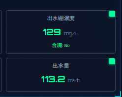
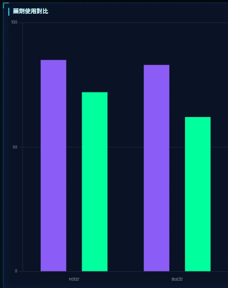

# 問題文檔

##   一、 流量表單 對應欄位 {#water-quality-ph}

- **H2O2 即時加藥量**
  - 欄位名稱: `amount_H2O2_P_209AB`
  - 資料型態: `float`
- **BaCl_2 即時加藥量**
  - 欄位名稱: `amount_BaCl2_P_210AB`
  - 資料型態: `float`
- **水質監測**
  - **進水硼濃度**
    - 欄位名稱: `concentration_B`
    - 資料型態: `float`
  - **出水硼濃度**
    - 欄位名稱: 待確認
    - 資料型態: 待確認
  - **進水量**
    - 欄位名稱: `flow_FIT201`
    - 資料型態: `float`
  - **出水量**
    - 欄位名稱: `flow_waste`
    - 資料型態: `float`

### 2. COP硼廢水處理流程 對應欄位

- **Raw Water 運作**
  - 欄位名稱: `flow_FIT201` > 0
  - 資料型態: `boolean`(條件判斷)
- **pH 調整槽 狀態**
  - 欄位名稱: `pH_202_A`
  - 資料型態: `float`
- **氧化反應槽 狀態**
  - 欄位名稱: `ORP_1`
  - 資料型態: `float`
- **氧化反應槽 狀態**
  - 欄位名稱: `sswitch_react_H2O2`
  - 資料型態: `boolean`
- **化學沉降槽 狀態**
  - 欄位名稱: `switch_dose_BaCl2`
  - 資料型態: `boolean`
- **凝集槽 狀態**
  - 欄位名稱: `switch_dose_Polymer`
  - 資料型態: `boolean`
- **沉澱池 狀態**
  - 欄位名稱: `switch_circ_filter`
  - 資料型態: `boolean`
- **出水 狀態**
  - 欄位名稱: `switch_filtrate_discharged`
  - 資料型態: `boolean`

### 3. 統計長條圖 對應欄位

- **藥劑使用對比**
  
## 二、 資料處理問題

1. **右上角nav職位疑問**  
    
  廠務工程師這邊這個職位是有接資料庫?

2. **AI建議**  
    
  這是前端處理還是資料庫有對應欄位?

3. **合規判斷**  
    
  這裡只要前端處理?

4. **單位不一致**  
  [進水量、出水量](#water-quality-ph) 對應欄位單位為(m³)，前端是mg/L 是否前端處理換算?  
  [H2O2 即時加藥量、BaCl_2 即時加藥量](#water-quality-ph) 單位是L/min，實作需換算為L/h(L/min*60)，是前端處理還是後端?

5. **系統狀態與告警**  
    
  這個需要傳什麼資料給前端，還是前端能自行處理?

6. **藥劑使用對比**  
    
  這圖是左側H2O2 即時加藥量、BaCl2 即時加藥量的比較圖? 是純前端處理?

7. **資料庫實際拿取做法**  
  目前只看到資料庫的 schema，但後端這 table 的資料儲存做法是純粹 insert（只進不改）嗎？我是否只要隨時都取最新的 row 即可？